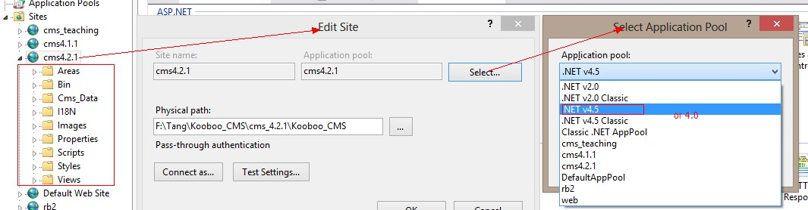

Download&Installation
----------------------------
1. Download
Go to [KoobooCMS](http://kooboo.codeplex.com/) and then go to section ``Download`` to download lastest stable version.
2. Extract the zip file ``Kooboo_CMS.zip``.
3. Install IIS
4. Create CMS website at IIS
  Setting:
  